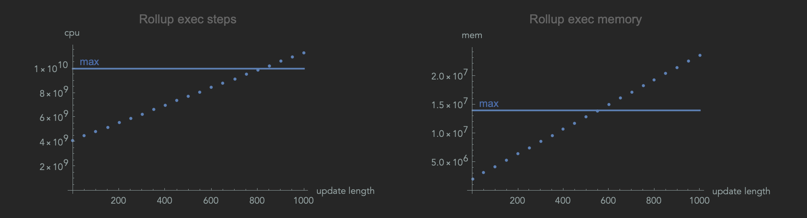

# Rollups benchmarks


Here we benchmark `rollup` script defined in `../../src/ZkFold/Cardano/Scripts/Rollup.hs`.

## Exec units as a function of *update length*

Instructions for running the benchmarks and summary of results.

### Running the benchmarks

Assuming `bench-rollup` is your active directory, execute:

```shell
cabal run bench-rollup
```

### Summary of results



Therefore, to be within budget, *update length* must be 654 or less.

For details, see [data-analysis.pdf](./data-analysis/data-analysis.pdf).
