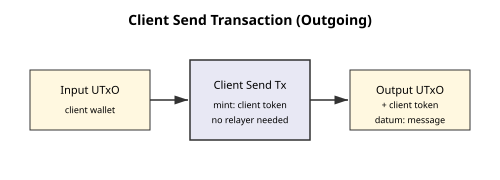

# Asterizm protocol CLI commands

This documents describes usage of our prototype implementation of the Asterizm protocol.

CLI commands are provided to

- compute the hash of a message
- derive client and relayer policy IDs
- relayer's certification of the message's hash
- client's sending of outgoing messages to the blockchain
- client's receiving of incoming messages with relayer verification
- retrieval of messages posted on the blockchain

Message certification by a relayer is represented by minting of a token whose policy ID is derived from the relayer's verification key. Its token-name is the hash of the message. Another token is also minted when client sends the original message to the blockchain, requiring validation that the token-name of a token minted by a valid relayer corresponds to the hash of the message.

## Generalities

Our Asterizm CLI commands are implemented using the [Atlas](https://atlas-app.io/) framework.

A core configuration file is required for all commands that interact with the blockchain. This file contains your configuration for network and provider. (File `./config-template.json` provides a template configuration.)

After each transaction is executed, the Transaction ID will be displayed.

## Help documentation

CLI commands can be invoked with

```shell
cabal run zkfold-cli:asterizm -- <command> [options]
```

We can query the list of available commands:

```shell
cabal run zkfold-cli:asterizm -- --help
```

```output
zkfold-cli:asterizm - Command-line utility to interact with Cardano. Provides
specific commands to manage the 'Asterizm' protocol.

Usage: asterizm (client | hash | buildCrosschainHash | buildHash | policy | relayer | retrieve-messages | user)

Available options:
  -h,--help                Show this help text

Available commands:
  client
  hash
  buildCrosschainHash
  buildHash
  policy
  relayer
  retrieve-messages
  user
```

We now describe each command.  The eager reader can jump to [section "End-to-end test"](#end-to-end-test) below to see a sample workflow.

### hash / buildCrosschainHash

Computes the Asterizm cross-chain hash of a given message. The message is provided as a HEX-encoded bytestring. The `hash` command is a backward-compatible alias for `buildCrosschainHash`.

```shell
cabal run zkfold-cli:asterizm -- hash --help
```

```output
Usage: asterizm hash --message HEX

Available options:
  --message HEX            Hex-encoded Asterizm structured message.
  -h,--help                Show this help text
```

```shell
cabal run zkfold-cli:asterizm -- buildCrosschainHash --message HEX
```

### buildHash

Computes the plain SHA-256 hash of a given packed message. This matches the Solidity helper pattern `sha256(abi.encodePacked(...))` when the provided HEX is exactly that packed byte sequence.

```shell
cabal run zkfold-cli:asterizm -- buildHash --message HEX
```

```output
Usage: asterizm buildHash --message HEX

Available options:
  --message HEX            Hex-encoded Asterizm structured message.
  -h,--help                Show this help text
```

### policy client

Derives and displays the client's policy ID. Does not interact with the blockchain.

```shell
cabal run zkfold-cli:asterizm -- policy client --help
```

```output
Usage: asterizm policy client --client-vkey-file FILEPATH
  [--relayer-vkey-file FILEPATH]
  [--trusted-address HEX]
  (--incoming | --outgoing)

Available options:
  --client-vkey-file FILEPATH
                           client's payment verification key file.
  --relayer-vkey-file FILEPATH
                           relayer's payment verification key file.
  --trusted-address HEX    Hex-encoded trusted Asterizm address: 8-byte chain
                           id followed by 32-byte address.
  --incoming               Incoming cross-chain message (requires relayer
                           verification).
  --outgoing               Outgoing cross-chain message (no relayer verification
                           needed).
  -h,--help                Show this help text
```

### policy relayer

Derives and displays a relayer's policy ID. Does not interact with the blockchain.

```shell
cabal run zkfold-cli:asterizm -- policy relayer --help
```

```output
Usage: asterizm policy relayer --relayer-vkey-file FILEPATH

Available options:
  --relayer-vkey-file FILEPATH
                           relayer's payment verification key file.
  -h,--help                Show this help text
```

### policy user

Displays the universal user policy ID. This policy is not parameterized and is the same for all users. It is the policy used by `user send` (for example, by `03-user-outgoing.sh`). Does not interact with the blockchain.

```shell
cabal run zkfold-cli:asterizm -- policy user --help
```

```output
Usage: asterizm policy user

Available options:
  -h,--help                Show this help text
```

### relayer

Command used by a relayer to mint a token certifying a client's message.

```shell
cabal run zkfold-cli:asterizm -- relayer --help
```

```output
Usage: asterizm relayer --core-config-file FILEPATH
  --signing-key-file FILEPATH
  --relayer-vkey-file FILEPATH
  --beneficiary-address ADDRESS
  --message-hash HEX

Available options:
  --core-config-file FILEPATH
                           Path to core config file (required).
  --signing-key-file FILEPATH
                           Payment signing key file.
  --relayer-vkey-file FILEPATH
                           relayer's payment verification key file.
  --beneficiary-address ADDRESS
                           Address of beneficiary receiving token(s).
  --message-hash HEX       Hex-encoded Asterizm message hash (32 bytes).
  -h,--help                Show this help text
```

### client send

Command used by client to send an outgoing message (Cardano as source chain). No relayer verification is required, but the transaction must reference the user's universal-policy token for the same message hash.

```shell
cabal run zkfold-cli:asterizm -- client send --help
```

```output
Usage: asterizm client send --core-config-file FILEPATH
  --signing-key-file FILEPATH
  --client-vkey-file FILEPATH
  [--trusted-address HEX]
  --beneficiary-address ADDRESS
  --message HEX

Available options:
  --core-config-file FILEPATH
                           Path to core config file (required).
  --signing-key-file FILEPATH
                           Payment signing key file.
  --client-vkey-file FILEPATH
                           client's payment verification key file.
  --trusted-address HEX    Hex-encoded trusted Asterizm address: 8-byte chain
                           id followed by 32-byte address.
  --beneficiary-address ADDRESS
                           Address of beneficiary receiving token(s).
  --message HEX            Hex-encoded Asterizm structured message.
  -h,--help                Show this help text
```

### user send

Command for any user to send a message to the blockchain. Unlike `client send`, this does not require a client verification key and does not enforce signature verification on-chain. All users share the same (universal) policy ID returned by `policy user`, not the client policy returned by `policy client --outgoing`. A later `client send` transaction references this token before minting the client-policy token.

```shell
cabal run zkfold-cli:asterizm -- user send --help
```

```output
Usage: asterizm user send --core-config-file FILEPATH
  --signing-key-file FILEPATH
  --beneficiary-address ADDRESS
  --message HEX

Available options:
  --core-config-file FILEPATH
                           Path to core config file (required).
  --signing-key-file FILEPATH
                           Payment signing key file.
  --beneficiary-address ADDRESS
                           Address of beneficiary receiving token(s).
  --message HEX            Hex-encoded Asterizm structured message.
  -h,--help                Show this help text
```

### client receive

Command used by client to receive an incoming message (Cardano as destination chain). Requires relayer verification.

Transaction references UTxO with relayer's token. Client's minting policy validates *a)* the relayer's policy ID against the allowed set and *b)* compatibility between the client's message and the message-hash contained in the relayer's token-name.

```shell
cabal run zkfold-cli:asterizm -- client receive --help
```

```output
Usage: asterizm client receive --core-config-file FILEPATH
  --signing-key-file FILEPATH
  --client-vkey-file FILEPATH
  [--relayer-vkey-file FILEPATH]
  [--trusted-address HEX]
  --beneficiary-address ADDRESS
  --message HEX

Available options:
  --core-config-file FILEPATH
                           Path to core config file (required).
  --signing-key-file FILEPATH
                           Payment signing key file.
  --client-vkey-file FILEPATH
                           client's payment verification key file.
  --relayer-vkey-file FILEPATH
                           relayer's payment verification key file.
  --trusted-address HEX    Hex-encoded trusted Asterizm address: 8-byte chain
                           id followed by 32-byte address.
  --beneficiary-address ADDRESS
                           Address of beneficiary receiving token(s).
  --message HEX            Hex-encoded Asterizm structured message.
  -h,--help                Show this help text
```

### retrieve-messages

Command to retrieve client's messages posted (revealed) to the blockchain.

```shell
cabal run zkfold-cli:asterizm -- retrieve-messages --help
```

```output
Usage: asterizm retrieve-messages --core-config-file FILEPATH
  --client-vkey-file FILEPATH
  [--relayer-vkey-file FILEPATH]
  [--trusted-address HEX]
  (--incoming | --outgoing)

Available options:
  --core-config-file FILEPATH
                           Path to core config file (required).
  --client-vkey-file FILEPATH
                           client's payment verification key file.
  --relayer-vkey-file FILEPATH
                           relayer's payment verification key file.
  --trusted-address HEX    Hex-encoded trusted Asterizm address: 8-byte chain
                           id followed by 32-byte address.
  --incoming               Incoming cross-chain message (requires relayer
                           verification).
  --outgoing               Outgoing cross-chain message (no relayer verification
                           needed).
  -h,--help                Show this help text
```

## End-to-end test

What follows is a sample workflow illustrating usage of *Asterizm* CLI commands.  (Diagrams look best with your browser in *light mode*.)


**Figure:** Process flows for incoming messages (Cardano as destination) and outgoing messages (Cardano as source)

### Generate Keys

```shell
asterizm$ ./00-keygen.sh client
asterizm$ ./00-keygen.sh relayer
asterizm$ ./00-keygen.sh user
```

This generates verification and signing keys for the client, relayer, and user roles.

### Policy IDs

Derive the client and relayer policy IDs. Trusted addresses are encoded as `chainId(8 bytes) || address(32 bytes)`.

```shell
asterizm$ trustedAddress="000000000000000100000000000000000000000039d2ba91296029afbe725436b4824ca803e27391"

asterizm$ # Client policy ID for incoming messages
asterizm$ cabal run zkfold-cli:asterizm -- policy client \
  --client-vkey-file ./keys/client.vkey \
  --relayer-vkey-file ./keys/relayer.vkey \
  --trusted-address "$trustedAddress" \
  --incoming
```

```output
<policy-id>
```

```shell
asterizm$ # Client policy ID for outgoing messages
asterizm$ cabal run zkfold-cli:asterizm -- policy client \
  --client-vkey-file ./keys/client.vkey \
  --trusted-address "$trustedAddress" \
  --outgoing
```

```output
<policy-id>
```

```shell
asterizm$ # Relayer policy ID
asterizm$ cabal run zkfold-cli:asterizm -- policy relayer \
  --relayer-vkey-file ./keys/relayer.vkey
```

```output
<policy-id>
```

### Relayer

The relayer mints a certification token for an incoming message:

```shell
asterizm$ # Build message and compute hash
asterizm$ message="0000000000000001...48656c6c6f2c20417374657269...<<hex message>>"
asterizm$ messageHash=$(cabal run zkfold-cli:asterizm -- buildCrosschainHash --message "$message" | tr -d '"')

asterizm$ cabal run zkfold-cli:asterizm -- relayer \
  --core-config-file ./assets/config.json \
  --signing-key-file ./keys/relayer.skey \
  --relayer-vkey-file ./keys/relayer.vkey \
  --beneficiary-address $(cat ./keys/relayer.addr) \
  --message-hash "$messageHash"
```

```output
"<transaction-id>"
```



**Figure:** Relayer's Tx

### Client Receive (Incoming Message)

The client receives an incoming message by validating the relayer's certification:

```shell
asterizm$ cabal run zkfold-cli:asterizm -- client receive \
  --core-config-file ./assets/config.json \
  --signing-key-file ./keys/client.skey \
  --client-vkey-file ./keys/client.vkey \
  --relayer-vkey-file ./keys/relayer.vkey \
  --trusted-address "$trustedAddress" \
  --beneficiary-address $(cat ./keys/client.addr) \
  --message "$message"
```

```output
"<transaction-id>"
```



**Figure:** Client's Tx

### User Send (Outgoing Message)

Any user can initiate an outgoing message by minting and sending a token under the universal user policy:

*Note:* The resulting token is minted under `policy user`. If you are scanning for messages created by `user send`, do not derive `policy client --outgoing` for that purpose.
Run this step before `client send` for the same message.

```shell
asterizm$ cabal run zkfold-cli:asterizm -- user send \
  --core-config-file ./assets/config.json \
  --signing-key-file ./keys/user.skey \
  --beneficiary-address $(cat ./keys/client.addr) \
  --message "$outgoingMessage"
```

```output
"<transaction-id>"
```

### Client Send (Outgoing Message)

After a user has posted an outgoing message under `policy user`, the client approves it by minting the corresponding client-policy token. The transaction references the user's token and checks the destination trusted address on-chain:

```shell
asterizm$ cabal run zkfold-cli:asterizm -- client send \
  --core-config-file ./assets/config.json \
  --signing-key-file ./keys/client.skey \
  --client-vkey-file ./keys/client.vkey \
  --trusted-address "$trustedAddress" \
  --beneficiary-address $(cat ./keys/client.addr) \
  --message "$outgoingMessage"
```

```output
"<transaction-id>"
```



**Figure:** Client Send Tx

### Retrieve Messages

```shell
asterizm$ # Retrieve incoming messages
asterizm$ cabal run zkfold-cli:asterizm -- retrieve-messages \
  --core-config-file ./assets/config.json \
  --client-vkey-file ./keys/client.vkey \
  --relayer-vkey-file ./keys/relayer.vkey \
  --trusted-address "$trustedAddress" \
  --incoming

asterizm$ # Retrieve outgoing messages
asterizm$ cabal run zkfold-cli:asterizm -- retrieve-messages \
  --core-config-file ./assets/config.json \
  --client-vkey-file ./keys/client.vkey \
  --trusted-address "$trustedAddress" \
  --outgoing
```

```output
Client's messages on-chain:

B "Hello, Asterizm!"
```

*Note:* `retrieve-messages` derives the client's policy ID from `--client-vkey-file`, so it only returns messages minted via `client send` / `client receive`. It does not retrieve transactions created by `user send`.

---

*Note:*  You can reproduce this workflow using the shell scripts provided in directory `./e2e-test/asterizm`.  (Make this your active directory.)  Generate keys using `./00-keygen.sh client`, `./00-keygen.sh relayer`, and `./00-keygen.sh user`, then fund the client, relayer, and user addresses before running the scripts. If your default compiler is not the project compiler, run scripts with `CABAL_FLAGS=--with-compiler=ghc-9.6.7`. Run the numbered scripts in order; `./04-client-outgoing.sh` depends on the universal-policy token posted by `./03-user-outgoing.sh`.
